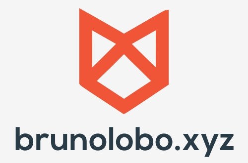

[![Contributors][contributors-shield]][contributors-url]
[![Forks][forks-shield]][forks-url]
[![Stargazers][stars-shield]][stars-url]
[![Issues][issues-shield]][issues-url]
[![MIT License][license-shield]][license-url]
[![LinkedIn][linkedin-shield]][linkedin-url]

<!-- PROJECT LOGO -->
<br />
<p align="center">
  <a href="https://github.com/lobobruno/bruteforce-geek2code">
    
  </a>

  <h3 align="center">Brute Force challenge</h3>

  <p align="center">
    Brute force challenge insta @geek2code 
    <br />
    <a href="https://github.com/lobobruno/bruteforce-geek2code"><strong>Explore the docs »</strong></a>
    <br />
    <br />
    <a href="https://github.com/lobobruno/bruteforce-geek2code">View Demo</a>
    ·
    <a href="https://github.com/lobchanobruno/bruteforce-geek2code/issues">Report Bug</a>
    ·
    <a href="https://github.com/lobobruno/bruteforce-geek2code/issues">Request Feature</a>
  </p>
</p>

<!-- ABOUT THE PROJECT -->

## About The Project

[![Product Name Screen Shot][product-screenshot]](https://github.com/lobobruno/bruteforce-geek2code/)

### Built With

- [Javascript]()
- [Node]()
- []()

<!-- GETTING STARTED -->

## Getting Started

To get a local copy up and running follow these simple steps.

### Prerequisites

No modules, needed! Vanila JS.

### Installation

1. Clone the repo
   ```sh
   git clone https://github.com/lobobruno/bruteforce-geek2code.git
   ```

<!-- USAGE EXAMPLES -->

## Usage

1. node App.js string_width number_of_threads

```sh
   node App.js 4 10
```

<!-- ROADMAP -->

## Roadmap

See the [open issues](https://github.com/lobobruno/bruteforce-geek2code/issues) for a list of proposed features (and known issues).

<!-- CONTRIBUTING -->

## Contributing

Contributions are what make the open source community such an amazing place to be learn, inspire, and create. Any contributions you make are **greatly appreciated**.

1. Fork the Project
2. Create your Feature Branch (`git checkout -b feature/AmazingFeature`)
3. Commit your Changes (`git commit -m 'Add some AmazingFeature'`)
4. Push to the Branch (`git push origin feature/AmazingFeature`)
5. Open a Pull Request

<!-- LICENSE -->

## License

Distributed under the MIT License. See `LICENSE` for more information.

<!-- CONTACT -->

## Contact

Bruno Lobo - [@brunowlf](https://twitter.com/brunowlf) - email

Project Link: [https://github.com/lobobruno/bruteforce-geek2code](https://github.com/lobobruno/bruteforce-geek2code)

<!-- MARKDOWN LINKS & IMAGES -->
<!-- https://www.markdownguide.org/basic-syntax/#reference-style-links -->

[contributors-shield]: https://img.shields.io/github/contributors/lobobruno/repo.svg?style=for-the-badge
[contributors-url]: https://github.com/lobobruno/repo/graphs/contributors
[forks-shield]: https://img.shields.io/github/forks/lobobruno/repo.svg?style=for-the-badge
[forks-url]: https://github.com/lobobruno/repo/network/members
[stars-shield]: https://img.shields.io/github/stars/lobobruno/repo.svg?style=for-the-badge
[stars-url]: https://github.com/lobobruno/repo/stargazers
[issues-shield]: https://img.shields.io/github/issues/lobobruno/repo.svg?style=for-the-badge
[issues-url]: https://github.com/lobobruno/repo/issues
[license-shield]: https://img.shields.io/github/license/lobobruno/repo.svg?style=for-the-badge
[license-url]: https://github.com/lobobruno/repo/blob/master/LICENSE.txt
[linkedin-shield]: https://img.shields.io/badge/-LinkedIn-black.svg?style=for-the-badge&logo=linkedin&colorB=555
[linkedin-url]: https://www.linkedin.com/in/lobobruno/
[product-screenshot]: images/screenshot.png
